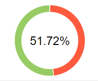

# Отчёт о проведённом тестировании

## Краткое описание

В ходе тестирования была выполнена проверка сайта покупки тура. Проверялась доступность сайта, интерфейс пользователя и взаимодействие фронтенда сайта с СУБД (MySQL и PostgreSQL).

## Количество тест-кейсов

| Всего тестов | Позитивные | Негативные  |
|:-:|:-:|:-:|
| 29 | 13  | 16 |
|  |  |  |

| Всего тестов | Доступность сайта | UI | СУБД  |
|:-:|:-:|:-:|:-:|
| 29 | 1 | 20  | 8 |
|  |  |  |  |

## Результат выполнения тестов

| Всего тестов | Успешно | Не успешно  | % успешных |
|-:|:-:|:-:|:-:|
| 29 | 15 | 14 | 51.72% |

## Общие рекомендации
