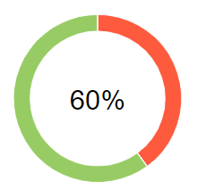

# Отчёт о проведённом тестировании

## Краткое описание

В ходе тестирования была выполнена проверка сайта покупки тура. Проверялась доступность сайта, интерфейс пользователя и взаимодействие фронтенда сайта с СУБД (MySQL и PostgreSQL).

## Количество тест-кейсов

| Всего тестов | Позитивные | Негативные  |
|:-:|:-:|:-:|
| 29 | 13  | 16 |

| Всего тестов | Доступность сайта | Пользовательский интерфейс | СУБД  |
|:-:|:-:|:-:|:-:|
| 29 | 1 | 20  | 8 |

## Результат выполнения тестов

### Сводная таблица

| Всего тестов | Положительно | Отрицательно  | % успешных |
|:-:|:-:|:-:|:-:|
| 29 | 15 | 14 | 51.72% |

### Результаты по кейсам

| N |Кейс |Метод | Результат |
|:-:|:--|:--|:-:|
|1  |Страница "Путешествие дня" доступна по адресу localhost:8080 |shouldOpenOrderPage() |положительно|
|2  |Заявка "Кредит по данным карты" не отправляется со значением года прошлого периода в поле "Год|shouldNotSendCreditByCardWithTooBigYear() |положительно|
|3  |После отклоненной заявки "Купить в кредит", данные о завке со статусом DECLINED сохраняются в базе данных PostgreSQL.|shouldStoreDeclinedCreditByCardIntoMyPgDatabase() |отрицательно|
|4  |Заявка "Кредит по данным карты" не отправляется со значением месяца, меньше "01", в поле "Месяц"|shouldNotSendCreditByCardWithTooSmallMonth() |отрицательно|
|5  |Заявка "Кредит по данным карты" не отправляется со значением года прошлого периода в поле "Год"|shouldNotSendCreditByCardWithTooSmallYear() |положительно|
|6  |После успешной заявки "Купить", данные о платеже со статусом APPROVED сохраняются в базе данных PostgreSQL.|shouldStoreApprovedOrderByCardIntoMyPgDatabase() |отрицательно|
|7  |После успешной заявки "Купить в кредит", данные о платеже со статусом APPROVED сохраняются в базе данных PostgreSQL.|shouldStoreApprovedCreditByCardIntoPgDatabase() |отрицательно|
|8  |После отклоненной заявки "Купить в кредит", данные о завке со статусом DECLINED сохраняются в базе данных MySQL.|shouldStoreDeclinedCreditByCardIntoMySqlDatabase() |отрицательно|
|9  |Заявка "Оплата по карте" не отправляется со значением года прошлого периода в поле "Год"|shouldNotSendOrderByCardWithTooSmallYear() |положительно|
|10 |После успешной заявки "Купить", данные о платеже со статусом APPROVED сохраняются в базе данных MySQL.|shouldStoreApprovedOrderByCardIntoMySqlDatabase() |отрицательно|
|11 |После отклоненной заявки "Купить", данные о заявке со статусом DECLINED сохраняются в базе данных MySQL.|shouldStoreDeclinedOrderByCardIntoMySqlDatabase() |отрицательно|
|12 |Заявка "Оплата по карте" не отправляется со значением месяца, больше "12", в поле "Месяц"|shouldNotSendOrderByCardWithTooBigMonth() |положительно|
|13 |Заявка "Кредит по данным карты" не отправляется с невалидными значениями в полях "Номер карты" и "CVC/CVV"|shouldNotSendCreditByCardWithIncorrectNumberAndCvc() |положительно|
|14 |Заявка "Оплата по карте" не отправляется с символами на кириллице в поле "Владелец"|shouldNotSendOrderByCardWithIncorrectOwner() |отрицательно|
|15 |Заявка "Оплата по карте" не отправляется с невалидными значениями в полях "Номер карты" и "CVC/CVV"|shouldNotSendOrderByCardWithIncorrectNumberAndCvc() |положительно|
|16 |Заявка "Кредит по данным карты"  не отправляется с символами на кириллице в поле "Владелец"|shouldNotSendCreditByCardWithIncorrectOwner() |отрицапельно|
|17 |Заявка "Оплата по карте" не отправляется со значением месяца, меньше "01", в поле "Месяц"|shouldNotSendOrderByCardWithTooSmallMonth() |отрицательно|
|18 |Заявка "Оплата по карте", заполненная валидными данными карты со статусом *Approved* успешно одобрена банком|shouldApprovedOrderByCard() |положительно|
|19 |После отклоненной заявки "Купить", данные о заявке со статусом DECLINED сохраняются в базе данных PostgreSQL.|shouldStoreDeclinedOrderByCardIntoMyPgDatabase() |отрицательно|
|20 |Пустая форма заявки "Оплата по карте" не отправляется в банк|shouldNotSendOrderByCardWithEmptyFields() |положительно|
|21 |Заявка "Оплата по карте", заполненная данными карты со статусом *Declined* отклонена банком|shouldDeclinedOrderByDeclinedCard() |отрицательно|
|22 |Заявка "Оплата по карте", заполненная невалидными данными карты, отклонена банком|shouldDeclinedOrderByUnknownCard() |положительно|
|23 |Заявка "Кредит по данным карты", заполненная невалидными данными карты, отклонена банком|shouldDeclinedCreditByUnknownCard() |положительно|
|24 |Заявка "Кредит по данным карты", заполненная данными карты со статусом *Declined* отклонена банком|shouldDeclinedCreditByDeclinedCard() |отрицательно|
|25 |Пустая форма заявки "Кредит по данным карты" не отправляется в банк|shouldNotSendCreditByCardWithEmtyFields() |положительно|
|26 |Заявка "Оплата по карте" не отправляется со значением года далекого будущего периода в поле "Год"|shouldNotSendOrderByCardWithTooBigYear() |положительно|
|27 |После успешной заявки "Купить в кредит", данные о платеже со статусом APPROVED сохраняются в базе данных MySQL.|shouldStoreApprovedCreditByCardIntoMySqlDatabase() |отрицательно|
|28 |Заявка "Кредит по данным карты", заполненная валидными данными карты со статусом *Approved* успешно одобрена банком|shouldApprovedCreditByCard() |положительно|
|29 |Заявка "Кредит по данным карты" не отправляется со значением месяца, больше "12", в поле "Месяц"|shouldNotSendCreditByCardWithTooBigMonth() |положительно|

## Список дефектов

| N | Наименование | Критичность |
|:-:|---|:-:|
|1|Выводится уведомление "Операция одобрена банком" для операции оплаты по карте со статусом DECLINED | Низкая |
|2|Выводится уведомление "Операция одобрена банком" для операции получения кредита по карте со статусом DECLINED | Низкая |
|3|Выводится уведомление "Операция одобрена банком" для операции оплаты по невалидной карте | Низкая |
|4|Выводится уведомление "Операция одобрена банком" для операции получения кредита по невалидной карте | Низкая |
|5|Выводится уведомление "Операция одобрена банком" для операции оплаты по карте со значением "00" в поле месяца формы оплаты | Низкая |
|6|Выводится уведомление "Операция одобрена банком" для операции получения кредита по карте со значением "00" в поле месяца формы оплаты| Низкая |
|7|Сообщения об ошибках в полях формы оплаты продолжают отображаться после исправления ошибок | Низкая |
|8|Форма отправляется с символами на кириллице в поле "Владелец" | Низкая |
|9|В поле payment_id таблицы order_entity базы данных app, при оплате заказа, записывается значение поля transaction_id таблицы payment_entity | Низкая |
|10|Поле credit_id таблицы order_entity базы данных app не заполняется при выполнении операции оплаты в кредит | Низкая |
|11|Поля таблицы payment_entity в базе данных app не заполняется при выполнении операции оплаты в кредит | Низкая |

## Общие рекомендации
